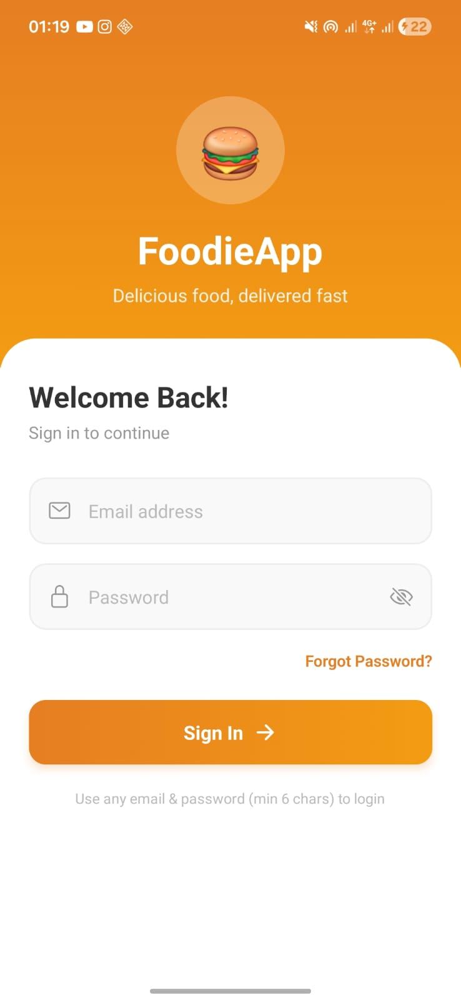

# FoodieApp — Food Ordering Mobile App

A food ordering mobile application built with React Native (Expo) as part of an internship assignment. The app allows users to browse food categories, add items to a cart, and place orders — all with a clean, modern UI designed around a Sri Lankan food ordering experience.

---

## Screenshots

| Login | Home | Food List |
|-------|------|-----------|
|  |  |  |

| Cart | Profile |
|------|---------|
|  |  |

---

## Features

- Dummy login with email and password validation
- Browse food categories — Pizza, Burger, Drinks, Desserts
- View food items per category with images, portion sizes, and LKR prices
- Add items to cart with quantity management
- Cart screen with subtotal, delivery fee, and total breakdown
- Place order with confirmation dialog
- Profile screen with user info and settings menu
- Dynamic greeting based on time of day
- Search bar to filter food categories
- Cart badge showing item count on tab bar and food list header
- Custom themed alert dialogs matching the orange color scheme
- Logout confirmation from Home and Profile screens

---

## Tech Stack

| Technology | Purpose |
|---|---|
| React Native (Expo) | Mobile app framework |
| TypeScript | Type-safe development |
| React Navigation | Screen navigation |
| Native Stack Navigator | Stack-based screen transitions |
| Bottom Tab Navigator | Tab bar navigation |
| React Context API | Cart state management |
| Expo Linear Gradient | Gradient UI elements |
| Expo Vector Icons | Tab bar and UI icons |
| StyleSheet API | Component styling |

---

## Project Structure

```
FoodOrderingApp/
├── app/
│   ├── screens/
│   │   ├── LoginScreen.tsx
│   │   ├── HomeScreen.tsx
│   │   ├── FoodListScreen.tsx
│   │   ├── CartScreen.tsx
│   │   └── ProfileScreen.tsx
│   ├── components/
│   │   └── CustomAlert.tsx
│   ├── context/
│   │   └── CartContext.tsx
│   ├── data/
│   │   └── foodData.ts
│   └── _layout.tsx
├── assets/
├── screenshots/
├── app.json
├── package.json
└── README.md
```

---

## Setup Instructions

### Prerequisites

- Node.js v18 or higher
- Expo Go app installed on your phone (available on Play Store and App Store)

### Steps

1. Clone the repository

```bash
git clone https://github.com/AbdWahhab/FoodOrderingApp.git
```

2. Navigate into the project folder

```bash
cd FoodOrderingApp
```

3. Install dependencies

```bash
npm install
```

4. Start the development server

```bash
npx expo start
```

5. Scan the QR code with the Expo Go app on your phone

### Login

The app uses dummy authentication. Enter any valid email address and a password of at least 6 characters to log in.

---

## Branch Structure

The project was developed using a feature branch workflow:

```
main
└── development
      ├── feature/ui-login
      ├── feature/ui-home
      ├── feature/ui-foodlist
      ├── feature/ui-cart
      └── feature/ui-profile
```

Each screen was developed and improved in its own branch, then merged into `development`, and finally into `main`.

---

## Notes

- No backend is used. All food data is stored locally in `app/data/foodData.ts`
- Prices are in Sri Lankan Rupees (LKR) and reflect realistic local market prices
- The app is optimized for Android but works on iOS as well via Expo Go