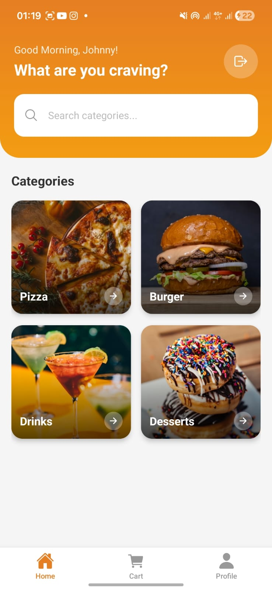
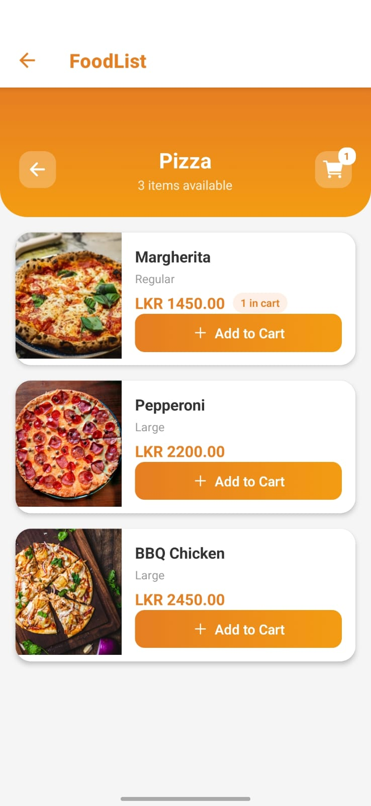
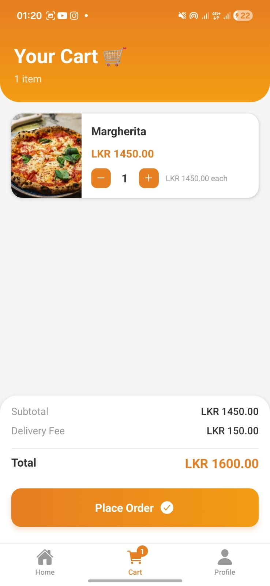
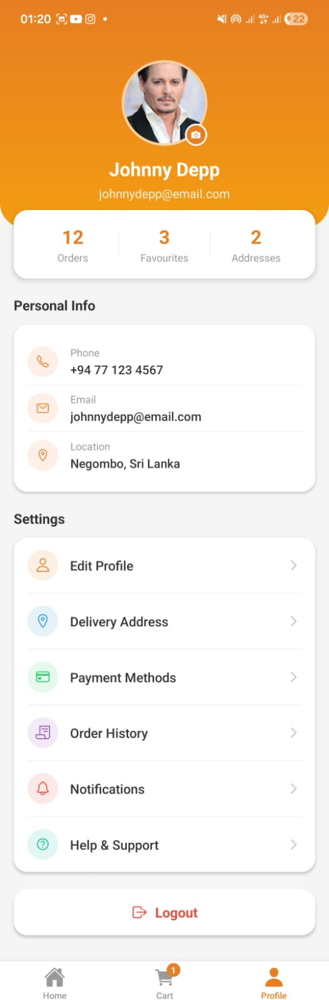

# 🍔 Food Ordering App

A simple and interactive food ordering mobile app built with React Native (Expo).

## 📱 Features

- Browse food categories (Pizza, Burger, Drinks, Desserts)
- View food items per category with images and prices
- Add items to cart
- Adjust item quantities in cart
- View total amount
- Place order with confirmation
- Profile screen with user info
- Cart badge showing number of items

## 📸 Screenshots

### Home Screen


### Food List Screen


### Cart Screen


### Profile Screen


## 🛠️ Libraries Used

| Library | Purpose |
|---|---|
| Expo | React Native framework |
| React Navigation | Screen navigation |
| @react-navigation/native-stack | Stack navigator |
| @react-navigation/bottom-tabs | Bottom tab navigator |
| react-native-screens | Native screen optimization |
| react-native-safe-area-context | Safe area handling |
| @expo/vector-icons | Tab bar icons |

## 🚀 Setup Instructions

### Prerequisites
- Node.js v18 or higher
- Expo Go app on your phone

### Steps

1. Clone the repository
   git clone https://github.com/YOUR_USERNAME/FoodOrderingApp.git

2. Navigate into the project
   cd FoodOrderingApp

3. Install dependencies
   npm install

4. Start the app
   npx expo start

5. Scan the QR code with Expo Go on your phone

## 🏗️ Project Structure
```
FoodOrderingApp/
├── app/
│   ├── screens/
│   │   ├── HomeScreen.tsx
│   │   ├── FoodListScreen.tsx
│   │   ├── CartScreen.tsx
│   │   └── ProfileScreen.tsx
│   ├── components/
│   ├── context/
│   │   └── CartContext.tsx
│   ├── data/
│   │   └── foodData.ts
│   └── _layout.tsx
├── assets/
├── app.json
└── package.json
```

## 👨‍💻 Tech Stack

- **Framework:** React Native (Expo)
- **Navigation:** React Navigation
- **State Management:** React Context API
- **Styling:** StyleSheet API